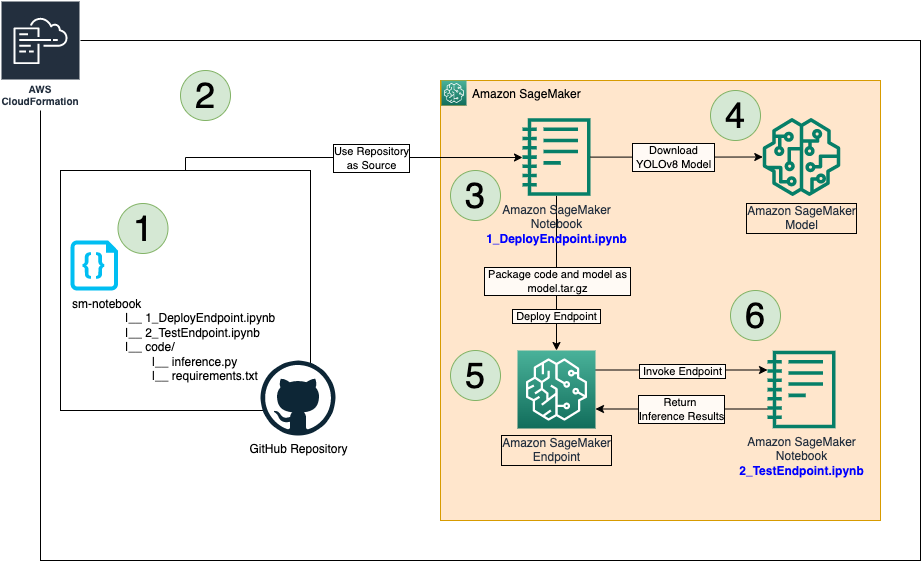

# CodeCommit to SageMaker Notebook

This Python implementation creates 1 S3 Bucket, 1 CodeCommit repo and 1 SageMaker Notebook



## Creation and Deployment
The project uses virtual environment. Use the following steps to setup the CDK Stack:
```
[To manually create a virtualenv on MacOS and Linux]
$ python3 -m venv .venv

[Activate the virtual environment]
$ source .venv/bin/activate

[Install the pre-requisites]
$ pip3 install -r requirements.txt

[CDK Creation and Deployment]
$ cdk synth
$ cdk bootstrap
$ cdk deploy
```

## Cleanup
To clear the stack and resources:
```
$ cdk destroy
```

## Useful commands
 * `cdk ls`          list all stacks in the app
 * `cdk synth`       emits the synthesized CloudFormation template
 * `cdk deploy`      deploy this stack to your default AWS account/region
 * `cdk diff`        compare deployed stack with current state
 * `cdk docs`        open CDK documentation